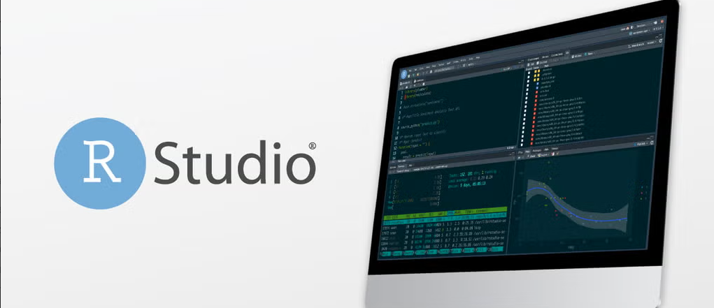
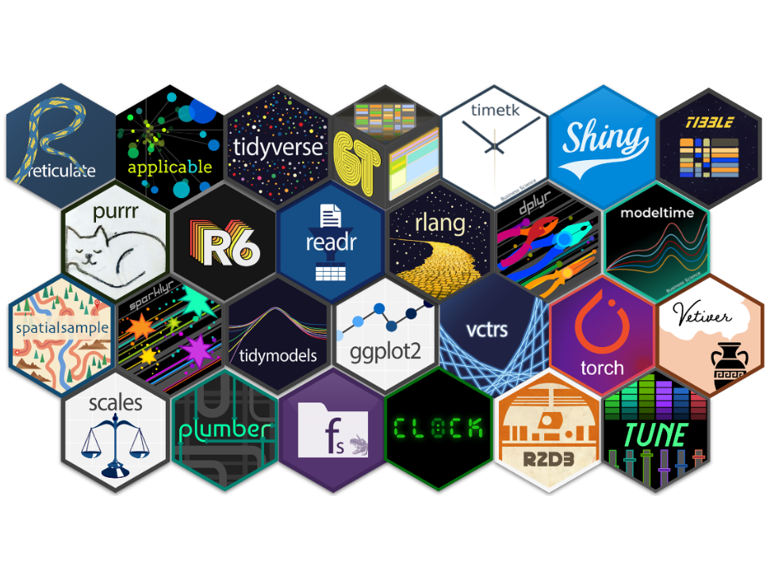
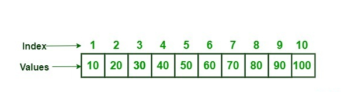
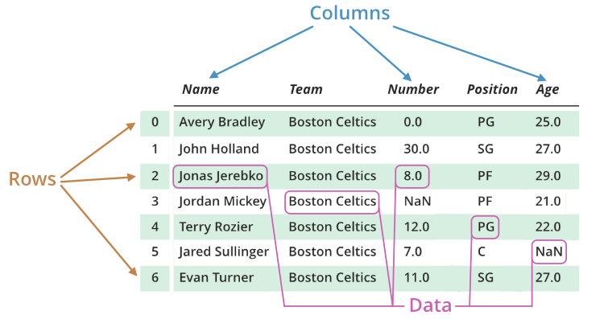
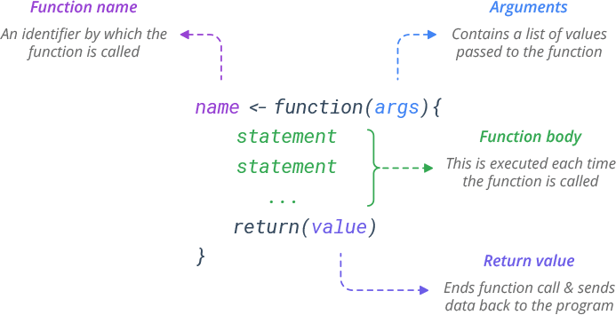

# Concepts

## Phylosophy

{fig-align="center" height="2%"}

-   Give a man a fish, and you feed him for a day. Teach a man to fish, and you feed him for a lifetime. - Maimonides

::: aside
All software is open-source and free.
:::

::: notes
Translate it to chinese:
:::

## What is R?

-   R is a free software environment for statistical computing and graphics. It compiles and runs on a wide variety of UNIX platforms, Windows and MacOS.
-   The R programming language was created by Ross Ihaka and Robert Gentleman at the University of Auckland, New Zealand.
-   Derives from old S language

{fig-align="right"}

::: aside
All software is open-source and free.
:::

## Software Components

-   R {fig-align="right" width=1in}
-   RStudio {fig-align="right" width=1in}
-   Prosit (VS Code) {fig-align="right" width=1in}
-   On line services (free){fig-align="right" width=1in}
-   R packages {fig-align="right" width=1in}

::: aside
All software is open-source and free to use and to change.
:::

# Programming Language Stracture

## R code syntax

``` {r }
#| code-line-numbers: "1|2-3|4"
print("Hello, World!")
library(ggplot2)
library(dplyr)
as_tibble(cars)
```

::: aside
Some code is borrowed from cs50 R https://cs50.harvard.edu/r/2024/
:::

## R object types

-   numeric
-   character
-   vector
-   factor
-   matrix
-   array
-   list
-   data frame

## Numeric

``` {r }
x <- 5
class(x)
is.numeric(x)
```

## Character

``` {r }
car <- "elevated blood pressure"
class(car)
```

## Numeric Vector

``` {r }
v <- c(10, 20, 30, 40, 50, 60, 70, 80, 90, 100)
class(v)
```

{fig-align="right"}

## Character Vector

``` {r }
car_v <- c("elevated", "blood", "pressure")
class(car_v)
```

## Factors Unordered

``` {r }
f <- factor(c("underweight", "underweight", "normal", "overweight", "normal"))
levels(f)
```

## Factor Ordered by level

``` {r }
# Enter ORIGINAL values in levels
# Enter the NEW level labels in labels
# Make sure the orderings of levels and labels correspond


y <- factor(c("underweight", "underweight", "normal", "overweight", "normal"),
            levels = c("underweight", "normal", "overweight"),
            labels = c("Underweight", "Normal", "Overweight"))
levels(y)
```

## Matrix

``` {r}
mat <- matrix(c(1,2,3,4,5,6), nrow = 2, ncol = 3)
mat 
```

## Lists

```{r}
y <- "my dog"
z <- 1:10
x <- list("5", c(1,2,3), y, z) # I put y, an object we created earlier, in this list
x
```

-   hold different types
-   different lengths

## DataFrames

```{r}
x <- data.frame(outcome = c(1,0,1,1),
                exposure = c("yes", "yes", "no", "no"),
                age = c(24, 55, 39, 18))
x
```

-   hold different types
-   but same length
-   columns have names
-   row have indices 

# Operators in R

## Arithmetic

| Operator | Description      |
|----------|------------------|
| `+`      | addition         |
| `-`      | subtraction      |
| `*`      | multiplication   |
| `/`      | division         |
| `^`      | exponent         |
| `%%`     | modulus          |
| `%/%`    | integer division |


## Relational

| Operator | Description      |
|----------|------------------|
| `<`      | less             |
| `>`      | more             |
| `==`     | equal            |
| `<=`     | equal or less    |
| `>=`     | equal or more    |
| `!=`     | not equal        |


## Logical

| Operator | Description      |
|----------|------------------|
| `&`      | and              |
| `|`      | or               |
| `!`      | logical not      |
| `&&`     | logical and      |
| `||`     | logical or       |

## Assignment operator

| Operator | Description      |
|----------|---------------------|
| `<-, <<-, =`| left assignment  |
| `->, ->>`   | right assignment |


# Functions



## Create A Function 


``` {r }
#| code-line-numbers: "1|2-3|4|5"
add <- function(number1, number2){
  sum <- number1 + number2
  return(sum)
}
```


## Create A Function 

-   argument names


``` {r }
#| code-line-numbers: "1|2-3|4|5"
result <- add(
  number1 = 2,
  number2 = 3
  )
print(result)
```


## Create A Function 

-   argument positions


``` {r }
#| code-line-numbers: "1|2-3|4|5"
result <- add(
  2,
  3
  )
print(result)
```
