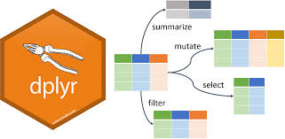
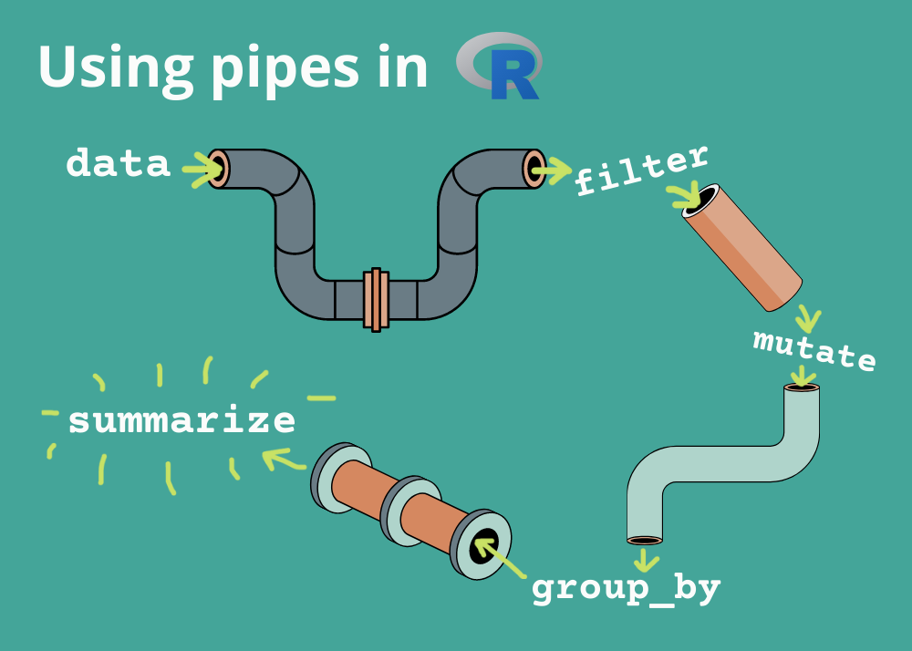

# Why to use dplyr?

## Unefficient way of doing things

```{r}
library(dplyr)
library(readr)
health_raw <- read_csv("data/healthcare_dataset.csv")
health_agb <- health_raw[, c("Age", "Gender", "Blood Type")]
health_agb_f <- health_agb[(health_agb$`Blood Type` %in% c("O+", "O-")), ]
health_agb_f_60 <- health_agb_f[health_agb_f$Age >= 60, ]
health_agb_f_60_m <- health_agb_f_60[health_agb_f_60$Gender %in% 'Male', ]
```

## dplyr[^1] package verbs

[^1]: website: <https://dplyr.tidyverse.org/>

-   `mutate()`: adds new variables that are functions of existing variables
-   `select()`: picks variables based on their names.
-   `filter()`: picks cases based on their values.
-   `summarise()`: reduces multiple values down to a single summary.
-   `arrange()`: changes the ordering of the rows. 

## Piping



Operators

-   migrattr: `%>%`

-   basic r version > 4.0.0: `|>`
